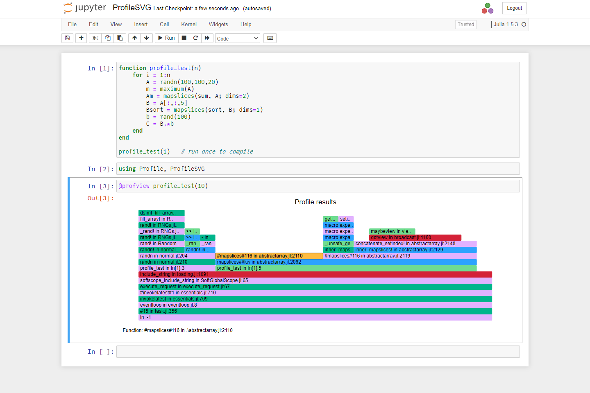
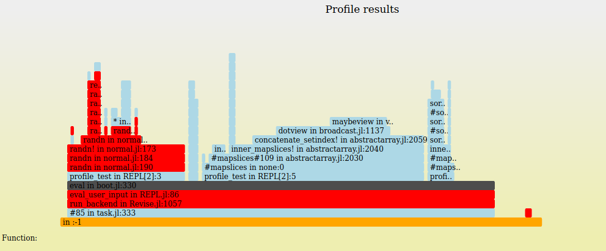

# ProfileSVG

[](https://travis-ci.com/timholy/ProfileSVG.jl)
[](https://codecov.io/gh/timholy/ProfileSVG.jl)

## ProfileSVG needs a competent maintainer!

ProfileSVG is looking for a maintainer who actually knows something about SVG and Javascript (unlike the current maintainer). Volunteers should file an issue.

## Purpose

ProfileSVG allows you to export profiling data as an SVG file.
It can be used to display profiling results in Jupyter/IJulia notebooks,
although the [ProfileVega](https://github.com/davidanthoff/ProfileVega.jl) package is
recommended as a better-maintained viewer for Jupyter notebooks.

An alternative visualization package is the GTK-based
[ProfileView](https://github.com/timholy/ProfileView.jl).
That package offers more interactive features, like the ability to
pan & zoom, as well as the ability to open source files by clicking on
elements of the flame graph.

ProfileSVG is essentially just an "export" package built on top of
[FlameGraphs](https://github.com/timholy/FlameGraphs.jl).
Among the Julia packages, ProfileView.jl currently has the most comprehensive
tutorial on how to interpret a flame graph.

## Usage

### Usage in Jupyter

```julia
using ProfileSVG
@profview f(args...)
```

where `f(args...)` is the operation you want to profile.
`@profview f(args...)` is just shorthand for

```julia
Profile.clear()
@profile f(args...)
ProfileSVG.view()
```

If you've already collected profiling data with `@profile`, you can just call `ProfileSVG.view()` directly.

The following screenshot illustrates Jupyter usage on a demonstration function `profile_test`:



You can hover over individual blocks in the flame graph to get more detailed information.

### Exporting to SVG

Even if you don't use Jupyter, you might want to export a flame graph as an SVG file
as a convenient way to share the results with others.

Here's a demonstration:

```julia
function profile_test(n)
    for i = 1:n
        A = randn(100,100,20)
        m = maximum(A)
        Am = mapslices(sum, A; dims=2)
        B = A[:,:,5]
        Bsort = mapslices(sort, B; dims=1)
        b = rand(100)
        C = B.*b
    end
end

profile_test(1)   # run once to compile

using Profile, ProfileSVG
Profile.clear()
@profile profile_test(10);

# Save a graph that looks like the Jupyter example above
ProfileSVG.save("/tmp/prof.svg")

# Save a graph that colors stackframes according to their module-of-origin
using FlameGraphs
ProfileSVG.save(StackFrameCategory(), "/tmp/prof2.svg")
```

The latter file looks something like this:



where the different colors indicate method definitions in different modules.
